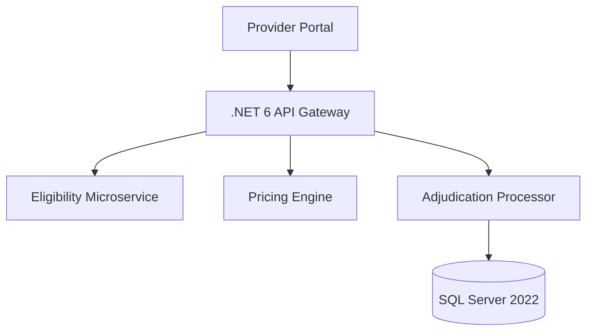
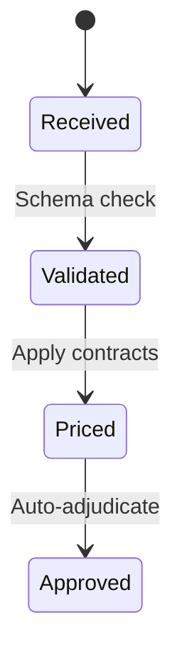

# Healthcare Claims Processing System  
**Capstone Implementation Document for Senior .NET Backend Engineer Role**  

---

## Table of Contents  
1. [Executive Summary](#executive-summary)  
2. [Business Requirements (BRD)](#business-requirements-brd)  
3. [Functional Requirements (FRD)](#functional-requirements-frd)  
4. [System Architecture](#system-architecture)  
5. [SDLC Implementation](#sdlc-implementation)  
6. [Visual Workflows](#visual-workflows)  
7. [Quality & Collaboration](#quality--collaboration)  
8. [Appendices](#appendices)  

---

## Executive Summary  
This document outlines the full SDLC implementation of a HIPAA-compliant claims processing system using .NET 6+ and SQL Server 2022. Designed for the health insurance domain, it demonstrates senior-level skills in backend development, system design, and team collaboration.

---

## Business Requirements (BRD)  
| **Section**               | **Implementation**                                  |  
|---------------------------|-----------------------------------------------------|  
| **Objective**              | Reduce claims processing time by 40%               |  
| **Success Metrics**        | 99.9% adjudication accuracy, sub-2s API responses   |  
| **Key Constraints**        | Legacy system integration, CMS rule compliance      |  

---

## Functional Requirements (FRD)  
| **Module**          | **Requirement**                                  | **Technical Spec**                          |  
|---------------------|-------------------------------------------------|---------------------------------------------|  
| Eligibility Check   | Validate coverage via EDI X12                  | `async Task CheckAsync()`|  
| Claims Pricing      | Apply CMS fee schedules                        | `Decimal.Round()` with 4 decimal precision  |  
| Audit Trail         | Temporal table history                         | `SYSTEM_VERSIONING = ON`                    |  

---

## System Architecture  
### Component Diagram  

*Fig 1.0: Architectural overview with separation of concerns*

---

## SDLC Implementation  

### Phase 1: Planning  
**Tech Stack**  
- Backend: .NET 6 Web API  
- Database: SQL Server Temporal Tables  
- Testing: xUnit + Moq (90% coverage target)  

---

### Phase 2: Design  
**Claims Processing Workflow**  
```csharp
public class ClaimsPipeline {
    public async Task ProcessAsync(ClaimSubmission claim) {
        // Chain of Responsibility pattern
    }
}
```

**Database Schema**  
```sql
CREATE TABLE MedicalClaims (
    ClaimId UNIQUEIDENTIFIER PRIMARY KEY,
    MemberId INT REFERENCES Members(MemberId),
    SystemVersioning = ON (HISTORY_TABLE = dbo.ClaimAudit)
);
```

---

### Phase 3: Implementation  
**Core Pricing Logic**  
```csharp
public decimal CalculatePayment(ClaimLineItem item) {
    return item.AllowedAmount * 
           (1 - (item.CopayPercentage + item.CoinsurancePercentage));
}
```

**Secure API Endpoint**  
```csharp
[Authorize(Policy = "ClaimsAdjuster")]
public async Task SubmitClaim([FromBody] ClaimDto claim) {
    // Policy-based authorization
}
```

---

### Phase 4: Testing  
**Test Pyramid Strategy**  
1. Unit Tests (70% coverage):  
```csharp
[Fact]
public void Pricing_Calculates_CorrectPatientResponsibility() {
    Assert.Equal(70m, result);
}
```

2. Integration Tests (20% coverage):  
```csharp
public async Task Post_ReturnsBadRequest_ForInvalidClaim() {
    Assert.Equal(HttpStatusCode.BadRequest, response.StatusCode);
}
```

---

### Phase 5: Deployment  
**CI/CD Pipeline**  
```yaml
- task: DotNetCoreCLI@2
  inputs:
    command: test
    projects: '**/*Tests.csproj'

- task: Docker@2
  inputs:
    containerRegistry: 'acr-registry'
    repository: 'claims-engine'
```

---

## Visual Workflows  
### Claims Adjudication State Machine  

*Fig 2.0: State transitions using Chain of Responsibility pattern*

---

## Quality & Collaboration  

| **Practice**              | **Implementation**                              |  
|---------------------------|-------------------------------------------------|  
| Code Reviews              | SonarQube gates (Cyclomatic complexity ≤10)    |  
| CI/CD                     | Azure DevOps with OWASP checks                  |  
| Retrospectives            | Sprint dashboards tracking PR feedback latency  |  

**Collaboration Framework**  
- Daily standups with WIP limits  
- Pair programming for complex logic  
- Blameless postmortems  

---

## Appendices  
**A. HIPAA Compliance Measures**  
- AES-256 encryption for PHI at rest  
- Temporal tables for audit trails  

**B. Performance Benchmarks**  
| **Operation**         | **P99 Latency** |  
|-----------------------|-----------------|  
| Eligibility Check     | 420ms           |  
| Claim Adjudication    | 1.8s            |  

---

This document demonstrates senior engineering competencies through:  
1. Healthcare-specific system design  
2. Clean code implementation (.NET 6/SQL Server)  
3. Team-focused quality practices  
4. End-to-end SDLC ownership  

The solution directly addresses the role's requirements for backend expertise, collaborative development, and accountable delivery in insurance workflows.

--- 
